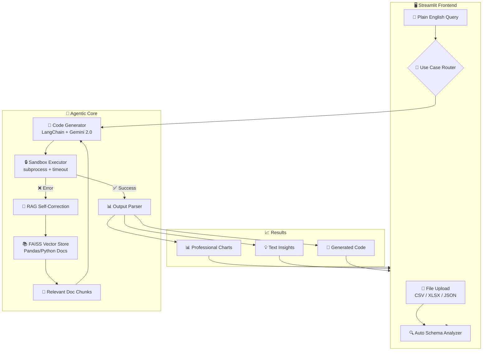

# 🤖 Autonomous Data Science Co-Pilot

> **An AI-powered agent that acts as your personal junior data analyst — upload data, ask questions in plain English, get professional charts and insights with zero coding.**

[](https://python.org)
[](https://streamlit.io)
[](https://langchain.com)
[](https://aistudio.google.com)
[](https://opensource.org/licenses/MIT)

---

## 📋 Project Information

| Field | Details |
|---|---|
| **Author** | Umang Vijay |
| **University** | JECRC University |
| **Project Type** | Major Project — Agentic AI / Data Engineering / Full-Stack Python |
| **Internship** | Celebal CEI Data Science Internship |
| **Tech Stack** | Python, Streamlit, LangChain, Google Gemini, FAISS, Pandas, Plotly |

---

## 🎯 Problem Statement

Non-technical users — founders, managers, analysts — need data insights but lack coding skills. Traditional dashboards require pre-built queries and rigid schemas. This project solves that by providing an **autonomous AI agent** that:

1. **Accepts** any CSV, Excel (.xlsx), or JSON file
2. **Understands** plain English questions
3. **Writes** Python/Pandas code autonomously
4. **Executes** code in a secure sandbox
5. **Self-corrects** errors using RAG over official documentation
6. **Delivers** professional charts and text insights

---

## 🏗️ Architecture Overview

```
┌─────────────────────────────────────────────────────────────────────┐
│                        STREAMLIT UI (app.py)                        │
│  ┌──────────────┐  ┌──────────────────┐  ┌───────────────────────┐ │
│  │ File Upload   │  │  Query Input     │  │  Use Case Selector    │ │
│  │ CSV/XLSX/JSON │  │  Plain English   │  │  Sales/Quality/Trend  │ │
│  └──────┬───────┘  └────────┬─────────┘  └───────────┬───────────┘ │
│         │                   │                         │             │
│         ▼                   ▼                         ▼             │
│  ┌──────────────────────────────────────────────────────────────┐   │
│  │              AUTO SCHEMA ANALYZER (on upload)                │   │
│  │   Columns • Types • Stats • Missing Values • Suggestions    │   │
│  └──────────────────────────┬───────────────────────────────────┘   │
└─────────────────────────────┼───────────────────────────────────────┘
                              │
                              ▼
┌─────────────────────────────────────────────────────────────────────┐
│                    AGENTIC CORE (core/agent.py)                     │
│                                                                     │
│  ┌─────────────────────────────────────────────────────────────┐   │
│  │  1. PROMPT BUILDER                                          │   │
│  │     Query + Schema + Use Case Template → Structured Prompt  │   │
│  └─────────────────────┬───────────────────────────────────────┘   │
│                        │                                            │
│                        ▼                                            │
│  ┌─────────────────────────────────────────────────────────────┐   │
│  │  2. CODE GENERATOR (LangChain + Google Gemini 2.0 Flash)   │   │
│  │     Prompt → Python/Pandas Code                             │   │
│  └─────────────────────┬───────────────────────────────────────┘   │
│                        │                                            │
│                        ▼                                            │
│  ┌─────────────────────────────────────────────────────────────┐   │
│  │  3. SANDBOX EXECUTOR (core/sandbox.py)                      │   │
│  │     subprocess.run() with timeout, import whitelist          │   │
│  │     ┌─────────┐                                             │   │
│  │     │ Success ├──────────────────────────────────────┐      │   │
│  │     └─────────┘                                      │      │   │
│  │     ┌─────────┐      ┌──────────────────────────┐    │      │   │
│  │     │  Error  ├─────►│  RAG SELF-CORRECTION     │    │      │   │
│  │     └─────────┘      │  (core/rag_pipeline.py)  │    │      │   │
│  │                      │                          │    │      │   │
│  │                      │  Error + Code            │    │      │   │
│  │                      │       │                  │    │      │   │
│  │                      │       ▼                  │    │      │   │
│  │                      │  ┌──────────────────┐   │    │      │   │
│  │                      │  │ FAISS Vector DB  │   │    │      │   │
│  │                      │  │ Pandas/Python    │   │    │      │   │
│  │                      │  │ Documentation    │   │    │      │   │
│  │                      │  └────────┬─────────┘   │    │      │   │
│  │                      │           │              │    │      │   │
│  │                      │           ▼              │    │      │   │
│  │                      │  Relevant Doc Chunks     │    │      │   │
│  │                      │       │                  │    │      │   │
│  │                      │       ▼                  │    │      │   │
│  │                      │  Regenerate Code ────────┤    │      │   │
│  │                      │  (up to 3 retries)       │    │      │   │
│  │                      └──────────────────────────┘    │      │   │
│  └──────────────────────────────────────────────────────┘      │   │
│                                                                 │   │
│                        ▼                                        │   │
│  ┌─────────────────────────────────────────────────────────┐   │   │
│  │  4. OUTPUT PARSER                                       │   │   │
│  │     Extract charts (Plotly/Matplotlib) + text insights  │   │   │
│  └─────────────────────────────────────────────────────────┘   │   │
└─────────────────────────────────────────────────────────────────────┘
                              │
                              ▼
┌─────────────────────────────────────────────────────────────────────┐
│                      FINAL OUTPUT TO USER                           │
│  ┌──────────────────┐  ┌──────────────────┐  ┌──────────────────┐ │
│  │ 📊 Professional  │  │ 💡 Text Insights │  │ 🔧 Generated    │ │
│  │    Charts        │  │    & Analysis    │  │    Code (view)  │ │
│  └──────────────────┘  └──────────────────┘  └──────────────────┘ │
└─────────────────────────────────────────────────────────────────────┘
```

### Mermaid Diagram



---

## 🚀 Features & Use Cases

### Core Use Cases

| # | Use Case | Description | Output |
|---|---|---|---|
| 1 | **Sales Dashboard** | Revenue aggregation by region, product, time period | Bar charts, pie charts, revenue KPIs |
| 2 | **Data Quality Audit** | Missing values, outliers (IQR), duplicates detection | Heatmaps, cleanliness report, fix suggestions |
| 3 | **Trend Analysis** | Time-series trend lines, rolling averages, seasonality | Line charts, trend observations, forecasts |
| 4 | **Cohort Analysis** | Customer segmentation by spend/activity/behavior | Grouped bar charts, segment heatmaps |
| 5 | **Ad-hoc Queries** | Any plain English question about the data | Dynamic charts + insights |

### Advanced Features

| Feature | Description | Tech |
|---|---|---|
| 🔮 **Predictive Forecasting** | Linear regression + ARIMA time-series forecasting | scikit-learn + statsmodels |
| 📋 **Auto Schema Summary** | Instant dataset analysis on upload | Gemini + Pandas profiling |
| 🔄 **Self-Correction Loop** | RAG-powered error recovery (up to 3 retries) | FAISS + LangChain |
| 🔒 **Sandbox Execution** | Secure code execution with timeout & import restrictions | Python subprocess |

---

## 📁 Project Structure

```
Umang_vijay-Jecrc_University_Major_project/
│
├── 📄 .env                          # API keys (gitignored)
├── 📄 .gitignore                    # Git ignore rules
├── 📄 requirements.txt             # Python dependencies
├── 📄 README.md                    # This file
│
├── 📁 .streamlit/
│   └── config.toml                  # Premium dark theme config
│
├── 🚀 app.py                       # Streamlit main entry point
│
├── 📁 core/                         # Core agent engine
│   ├── __init__.py
│   ├── agent.py                     # Agentic orchestrator (LangChain + Gemini)
│   ├── sandbox.py                   # Secure subprocess executor
│   ├── rag_pipeline.py              # FAISS RAG self-correction engine
│   ├── schema_analyzer.py           # Auto schema summary generator
│   └── use_cases.py                 # Prompt templates for all use cases
│
├── 📁 utils/                        # Utility modules
│   ├── __init__.py
│   ├── data_loader.py               # CSV/Excel/JSON loader & validator
│   ├── chart_renderer.py            # Plotly/Matplotlib chart utilities
│   └── insights_formatter.py        # Text insight formatting
│
├── 📁 docs_corpus/                  # RAG documentation corpus
│   ├── pandas_core.txt              # Pandas DataFrame operations
│   ├── pandas_plotting.txt          # Pandas & Matplotlib plotting
│   ├── python_errors.txt            # Common Python error patterns
│   └── numpy_basics.txt             # NumPy reference
│
├── 📁 sample_data/                  # Test datasets
│   ├── sales_data.csv               # Monthly sales (500 rows)
│   ├── customer_data.csv            # Customer records (300 rows)
│   └── timeseries_data.csv          # Daily metrics (365 rows)
│
└── 📁 notebooks/
    └── rag_self_correction_test.ipynb  # Isolated RAG loop testing
```

---

## 🛠️ Tech Stack

| Layer | Technology | Purpose |
|---|---|---|
| **Frontend** | Streamlit 1.35+ | Interactive web UI with dark theme |
| **LLM / Agent** | Google Gemini 2.0 Flash | Code generation & natural language understanding |
| **Agent Framework** | LangChain 0.3+ | Prompt management, chains, structured output |
| **Embeddings** | Google Generative AI Embeddings | Document vectorization for RAG |
| **Vector Store** | FAISS | Fast similarity search for error correction |
| **Data Processing** | Pandas, NumPy, OpenPyXL | DataFrame operations, Excel support |
| **Visualization** | Plotly, Matplotlib, Seaborn | Interactive & static professional charts |
| **ML / Forecasting** | scikit-learn, statsmodels | Linear Regression + ARIMA forecasting |
| **Execution** | Python subprocess | Sandboxed code execution |
| **Config** | python-dotenv | Secure API key management |

---

## ⚡ Quick Start

### Prerequisites

- **Python 3.10+** installed
- **Google Gemini API Key** from [Google AI Studio](https://aistudio.google.com/)
- **Git** for version control

### 1. Clone the Repository

```bash
git clone https://github.com/your-username/Umang_vijay-Jecrc_University_Major_project.git
cd Umang_vijay-Jecrc_University_Major_project
```

### 2. Create Virtual Environment

```bash
# Create virtual environment
python -m venv venv

# Activate (Windows)
.\venv\Scripts\activate

# Activate (macOS/Linux)
source venv/bin/activate
```

### 3. Install Dependencies

```bash
pip install -r requirements.txt
```

### 4. Configure API Key

Create a `.env` file in the project root (or edit the existing template):

```env
GOOGLE_API_KEY=your_actual_gemini_api_key_here
```

> 💡 **How to get a free API key:**
> 1. Go to [Google AI Studio](https://aistudio.google.com/)
> 2. Sign in with your Google account
> 3. Click **"Get API Key"** → **"Create API Key"**
> 4. Copy the key and paste it in `.env`

### 5. Run the Application

```bash
streamlit run app.py
```

The app will open at `http://localhost:8501` 🚀

---

## 📖 How to Use

### Step 1: Upload Your Data
- Click the **file uploader** in the sidebar
- Supported formats: **CSV**, **Excel (.xlsx)**, **JSON**
- Or use the **sample data** buttons for quick testing

### Step 2: Review Auto-Generated Schema
- Upon upload, the system **automatically analyzes** your dataset
- View column types, statistics, missing values, and suggested use cases

### Step 3: Select a Use Case
- Choose from the dropdown: Sales Dashboard, Data Quality Audit, Trend Analysis, Cohort Analysis, or Ad-hoc Query

### Step 4: Ask Your Question
- Type a plain English question like:
  - *"Show me revenue by region as a bar chart"*
  - *"Find all missing values and outliers"*
  - *"Plot the monthly sales trend with a forecast"*
  - *"Segment customers by spending level"*

### Step 5: Get Results
- The AI agent **autonomously writes code**, executes it, and delivers:
  - 📊 **Professional Charts** (interactive Plotly or static Matplotlib)
  - 💡 **Text Insights** and analysis
  - 🔧 **Generated Code** (viewable in collapsible section)

---

## 🔄 Self-Correction Loop (RAG Pipeline)

The system implements an intelligent self-correction mechanism:

```
User Query → Generate Code → Execute in Sandbox
                                    │
                              ┌─────┴─────┐
                              │  Success?  │
                              └─────┬─────┘
                           Yes │         │ No
                               ▼         ▼
                          Return     RAG Query
                          Results    FAISS DB
                                        │
                                        ▼
                                  Retrieve Relevant
                                  Documentation
                                        │
                                        ▼
                                  Regenerate Code
                                  (with doc context)
                                        │
                                        ▼
                                  Re-execute
                                  (up to 3 retries)
```

1. **Error Capture**: Sandbox catches `stderr` from failed execution
2. **RAG Query**: Error message is embedded and searched against FAISS index of Pandas/Python docs
3. **Context Augmentation**: Top-5 relevant documentation chunks are added to the prompt
4. **Code Regeneration**: Gemini rewrites the code with documentation context
5. **Re-execution**: Fixed code runs in sandbox again (max 3 attempts)

---

## 🔮 Predictive Forecasting

The system supports two forecasting methods:

### Linear Regression (scikit-learn)
- Best for: Data with clear linear trends
- Approach: Fits a linear model to time-indexed data
- Output: Trend line + future predictions

### ARIMA (statsmodels)
- Best for: Time-series with seasonality and autocorrelation
- Approach: Auto-fits ARIMA(p,d,q) parameters
- Output: Forecast with confidence intervals

The agent automatically selects the best method based on data characteristics, or users can specify their preference in the query.

---

## 🧪 Testing the RAG Loop

A dedicated Jupyter notebook is provided for isolated testing:

```bash
cd notebooks
jupyter notebook rag_self_correction_test.ipynb
```

The notebook tests:
- FAISS index building from documentation corpus
- Error-to-documentation retrieval accuracy
- Code generation → execution → correction cycle
- End-to-end success rate metrics

---

## 🛡️ Security

- **Sandboxed Execution**: All generated code runs in an isolated subprocess
- **Import Whitelist**: Only `pandas`, `numpy`, `matplotlib`, `plotly`, `seaborn`, `sklearn`, `statsmodels` are allowed
- **Timeout**: Execution limited to 30 seconds
- **No Network**: Sandbox has no network access
- **API Key Security**: Stored in `.env` (gitignored), never committed

---

## 🤝 Contributing

1. Fork the repository
2. Create a feature branch (`git checkout -b feature/amazing-feature`)
3. Commit your changes (`git commit -m 'Add amazing feature'`)
4. Push to the branch (`git push origin feature/amazing-feature`)
5. Open a Pull Request

---

## 📄 License

This project is licensed under the MIT License — see the [LICENSE](LICENSE) file for details.

---

## 🙏 Acknowledgments

- **Celebal Technologies** — CEI Data Science Internship program
- **JECRC University** — Academic guidance and support
- **Google** — Gemini API for generative AI capabilities
- **LangChain** — Agent framework and RAG pipeline tools
- **Meta AI** — FAISS vector similarity search library

---

<p align="center">
  <b>Built with ❤️ by Umang Vijay | JECRC University</b>
</p>
